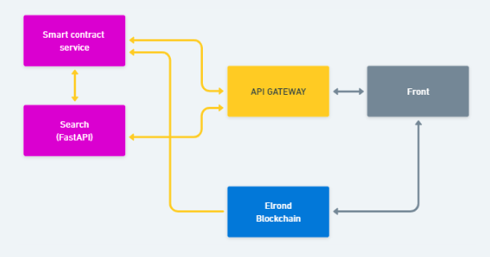
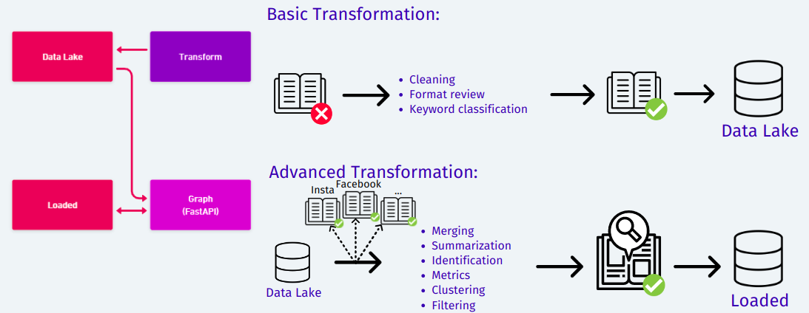
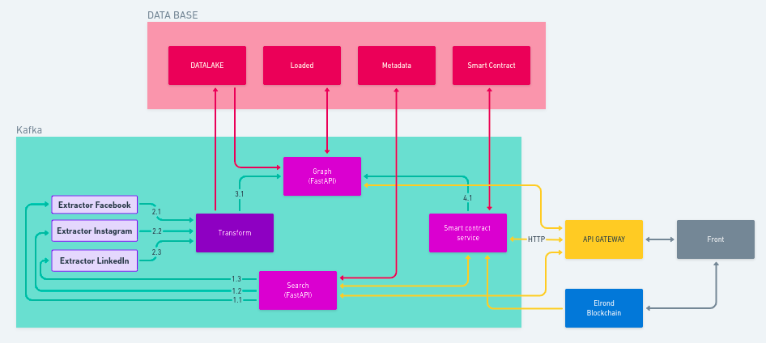

# Profil hunt

## Presentation

Profil Hunt is an OSINT (Open Source Intelligence) application that helps you find information about a person by scanning different social networks. It allows you to collect information such as user names, social media profiles, images, posts, friends, and groups associated with a specific person. With its advanced algorithm, Profil Hunt enables you to find information quickly and efficiently, making it an indispensable tool for online investigators, private detectives, and employers who are looking to gather information about a person. Additionally, Profil Hunt uses Elrond Web3 technology to ensure the security and privacy of user data. MultiversX (ex Elrond) is used as payment method for start a research on person. All relevant information is collected and is public. In addition, all searches are public and the application's sole purpose is preventive.

> https://www.youtube.com/watch?v=s_-7FsZDec8

### Main features

- Data extraction from social networks **(facebook, linkedin, instagram)**
- Analysis and processing of collected information **(ETL)**
- Communication with the **MultiversX** Blockchain (formerly Elrond)

### Technical choices

- Angular 
- MultiversX Blockchain (formerly Elrond)
- Fastapi python
- Kafka
- MongoDB

## Front & Search




- Angular
- API Gateway : Traefik
- Blockchain MultiversX (formerly Elrond)
    - Smart contract
    - Security:
        - Authentication
        - Authorization

- Search service : FastAPI

## Excractor 

- API Graph Instagram
- Scrapper/Crawler: BeautifulSoup4/Selenium

> Find target => creation of a dictonary with all the data available => transform

## Transformation & Graph




## Global view




## How to run 

> Change /etc/hosts add
```
127.0.0.1 front.eola.local
127.0.0.1 eola.local
```
> Create the newtork docker
```
docker network create ph-test 
```

> Run the application 

```
docker-compose up search-service 
```

!!!!! Each Eeach project have is own readme for more information
